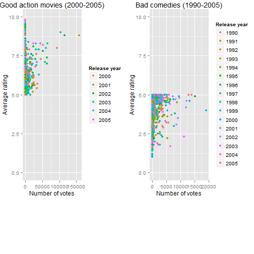

## Overview

# Functionality

* This app allows the user to query selected movies from the movies dataset based on their release year, average ratings as well as genre classification using the sidebar panel. These parameters will be displayed "live" in the 'Parameters selected' part of the main panel for review (before pressing the 'Submit' button). After the 'Submit' button is pressed, the ratings scatter plot and underlying movies table are displayed in the main panel.

# Layout

* The screen layout is divided into:

  1) a sidebar panel containing the user-specified parameters (release year, rating, genre), and
  
  2) a main panel with the app documentation, a display of parameters entered by the user (for control and transparency) and the results of the server calculations, i.e. the scatter plot of average user-given rating by total number of votes cast (movies are organized by release year - cf. legend) and the table of the selected movies data for identifying which movie is represented by each point in the scatter plot and providing additional data (mpaa rating, budget, length).

--- 
## Parameters specifications and review

* The sidebar panel is dedicated to defining parameters for querying the movies dataset.

* The user can pick a range of release years and user-given ratings using the appropriate sliders.

* The user can also filter the dataset based on movies genre using the set of checkboxes. It is possible to include one or several genres. Movies may be listed under several genres themselves, the results will return movies that satisfy all genres selected.

--- 
## Results review

* Below are two examples of results, that can be achieved using the app:

  1) Good action movies (i.e. with ratings >= 5) released from 2000 to 2005
  
  2) Bad comedies (i.e. with ratings <= 5) released from 1990 to 2005
  

 
